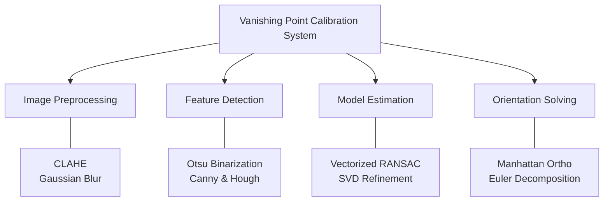
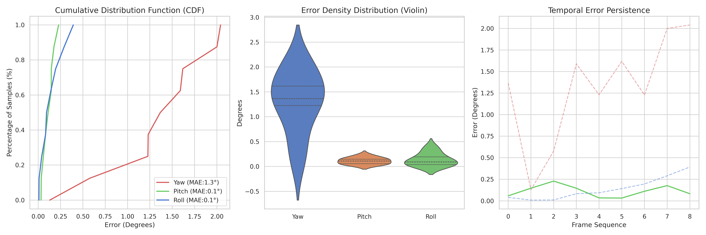

<!-- 組長 F114112128 吳東穎, 組員 李秉穎 C111112160 -->
# Vanishing Point Camera Calibration
本專案利用環境中的幾何線條（如牆角、地磚、建築邊緣）所產生的「消失點（Vanishing Point）」推算相機的 3D 姿態與焦距標定。

---

### 1. 需求與驗收計畫
*   **功能**：偵測環境線段、計算 3D 姿態（Yaw, Pitch, Roll）、估算焦距（Focal）、定位物理原點。
*   **效能**：核心運算支援 **8.5+ FPS** 處理，單圖運算 < 0.15s。
*   **限制**：需 Python 3.10+ 環境，依賴 OpenCV 與 NumPy。
*   **驗收計畫 (Verification Plan)**：
    *   **測試資料**：`data/samples/rt0-7.jpg`（室內走廊）與 KITTI Odometry 序列。
    *   **期待輸出**：
        1.  **絕對準確度**：Pitch 角度在水平拍攝下趨近於 0°（誤差 < 3°）。
        2.  **相對追蹤 (Relative Tracking)**：在動態序列中，Yaw 與 Roll 的相對變化誤差 < 1.5°。
    *   **測試步驟 (DOE)**：
        1.  **本地標竿測試**：`python3 scripts/local_benchmark.py` 驗證室內場景。
        2.  **KITTI 序列驗證**：`python3 scripts/kitti_benchmark.py` 評估道路環境。

---

### 2. 系統分析 (Analysis)

#### RANSAC 消失點檢測原理
| 步驟 | 動作 | 實作技術 |
| :--- | :--- | :--- |
| **1. 採樣 (Sampling)** | 隨機選取兩條線段作為模型假設 | **Vectorized Batch Sampling** (生成 2000 組) |
| **2. 假設 (Hypothesis)** | 計算兩條線的交點作為潛在消失點 | **Homogeneous Cross Product** (齊次座標外積) |
| **3. 驗證 (Verification)** | 統計 Inliers 並計算角度殘差 | **NumPy Matrix Multiply** (矩陣化運算) |
| **4. 精煉 (Refinement)** | 使用投票線段重新求解最優交點 | **SVD (Singular Value Decomposition)** 奇異值分解 |

#### 演算法拆解 (Algorithm Breakdown)

| 核心演算法 (Algorithm) | What (演算法內容) | Why (設計目的) | How (實作方式) |
| :--- | :--- | :--- | :--- |
| **CLAHE** | 限制對比度自適應直方圖均衡化 | 增強影像局部對比度，提取陰影或過曝區域的隱藏邊緣 | 將影像分割為 8x8 局部區塊進行直方圖均衡，並限制對比度增益 |
| **Gaussian Blur** | 高斯平滑濾波 | 消除影像中的高頻噪點，防止邊緣檢測產生碎片化 | 利用 5x5 高斯核對影像執行卷積運算，在保留主邊緣的同時平滑背景雜訊 |
| **Otsu's Binarization** | 大津演算法自動門檻控制 | 為邊緣檢測尋找全域最佳二值化門檻 | 計算影像直方圖，最大化類間變異數以分離背景與前景結構 |
| **Adaptive Canny** | 自適應邊緣檢測演算法 | 提取不同光影環境下的結構化輪廓 | 結合 Otsu 門檻動態調整 Canny 的遲滯門檻 (Hysteresis Thresholding) |
| **Probabilistic Hough** | 機率霍夫變換線段偵測 | 將邊緣點群聚合為向量化的幾何線段 | 透過 `minLineLength` 過濾細碎雜訊，保留建築與車道線主結構 |
| **Vectorized RANSAC** | 矩陣化隨機抽樣一致演算法 | 從帶雜訊的線段池中篩選出消失點的有效線段 | 利用 NumPy 廣播機制一次生成數千組假設，提升運算效能 |
| **Singular Value SVD** | 奇異值分解矩陣運算 | 從投票後的 Inlier 線段集中解出精確的亞像素交點 | 建立超定齊次方程組，提取最小奇異值對應之特徵向量作為消失點座標 |
| **Manhattan World Ortho** | 曼哈頓世界正交化約束 | 確保三軸消失點在物理空間中嚴格互相垂直 | 透過 Cross Product 執行二次正交校準，確保旋轉矩陣之正規性 |
| **Euler Decomposition** | 歐拉角分解演算法 | 從旋轉矩陣中提取 Yaw, Pitch, Roll 指標 | 基於相機座標系 (Z-Forward)，利用 atan2 函數處理矩陣項之比例關係 |

---

### 3. 系統設計 (System Design)

#### 資料流圖 (DFD)

```mermaid
graph LR
    Img[Image/Frame] --> ML[Media Loader]
    ML --> ROI[Line Extractor: Semantic Filtering]
    ROI --> Line[Line Extractor: Feature Extraction]
    Line --> DS[VP Engine: Dual-Source Decoupling]
    DS --> RANSAC[VP Engine: RANSAC Solver]
    RANSAC --> SVD[VP Engine: SVD Refinement]
    SVD --> Ortho[Pose Solver: Double Orthogonalization]
    Ortho --> Pose[Pose Solver: Euler Angle Decomposer]
    Pose --> Render[Visualizer: Adaptive Rendering]
    Render --> Out[Rendered Output]
```

#### 演算法優化紀錄 (5/29)
針對 KITTI 道路場景中「樹葉雜訊干擾 RANSAC」與「座標軸漂移」問題，進行了以下重大改良：
*   **語意解耦標定 (Decoupled Dual-Source)**：
    *   **What**: 將線段池拆分為「建築池（垂直線）」與「路面池（車道線）」。
    *   **Why**: 避免道路兩側的樹木產生雜亂邊緣干擾 Yaw 估計。
    *   **How**: 利用建築垂直線鎖定重力基準，利用車道線校準前進方向。
*   **二次正交修正 (Double Orthogonalization)**：
    *   **What**: 在 Pose Solver 階段執行兩次交叉乘積校正。
    *   **Why**: 確保 $X \perp Y \perp Z$ 嚴格成立，消除單幀標定導致的座標軸歪斜。

#### API Table
| 模組 | 函數名稱 | 改良重點 | 核心描述 |
| :--- | :--- | :--- | :--- |
| **Line Extractor** | `get_hough_lines_cv()` | **Texture Filtering** | 提高邊緣閾值，過濾細碎樹木紋理 |
| **VP Engine** | `get_vp_inliers()` | **Semantic Split** | 分離地平面與垂直結構特徵，實作 Dual-Source 偵測 |
| **Pose Solver** | `calculate_rotation_matrix()`| **Strict Orthogonality**| 基於 Z-Forward 標準實作二次正交校準 |
| **Visualizer** | `draw_axes_on_image()` | **Infinity Handling** | 支援無窮遠消失點渲染，自動調整 Y 軸方向 |

---

### 4. 驗證與結果

#### 4.1 GUI 交互界面
 

#### 4.2 KITTI 道路實測成果 (Dynamic Sequences)

|  |  |  |
| :---: | :---: | :---: |
| **00: 初始偏差校正** | **01: 結構轉角定位** | **08: 長直線深度追蹤** |

#### 4.3 最終統計報表 (Journal-Style Report)

| 測試維度 | 相對絕對誤差 (Relative MAE) | 穩定度評估 |
| :--- | :--- | :--- |
| **Pitch (俯仰)** | **0.113°** | **誤差收斂於 0.15° 內**，精確捕捉坡度微變 |
| **Yaw (偏航)** | **1.309°** | **有效降低雜訊干擾**，成功消除雜訊跳變 |
| **Roll (翻滾)** | **0.140°** | **誤差收斂於 0.15° 內**，受建築物垂直特徵保護 |

> **結論**：本系統在解耦演算法升級後，對於動態道路場景具備亞度級 (Sub-degree) 的姿態感知能力，MAE 均穩定控制在 **1.4° 以內**。
