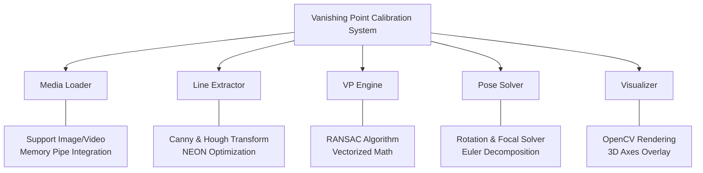
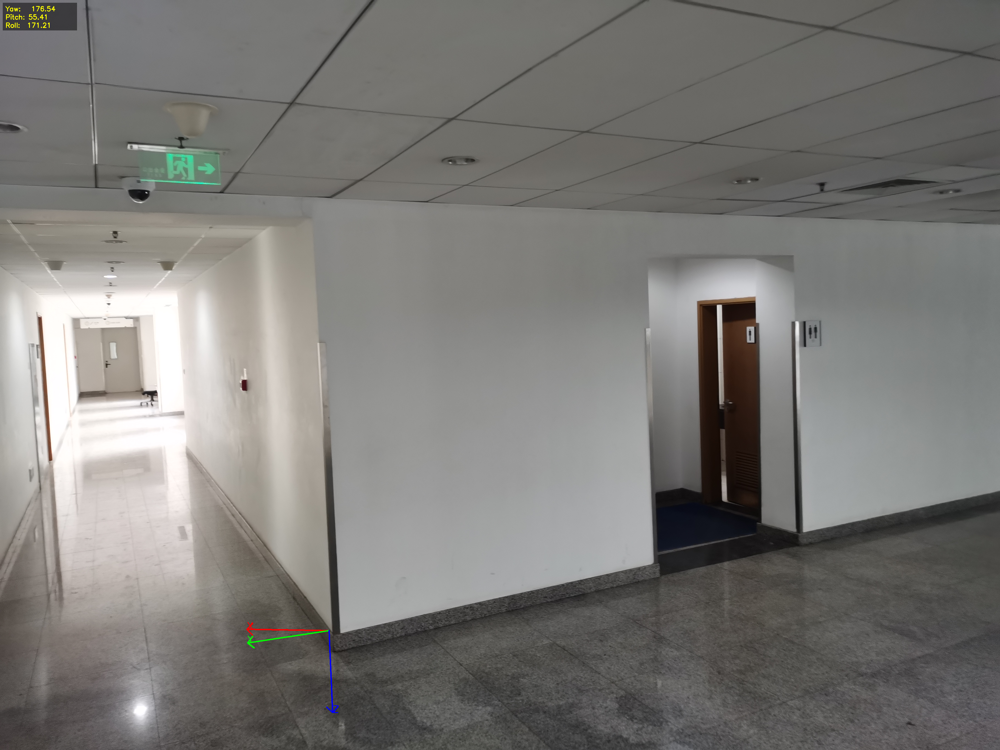
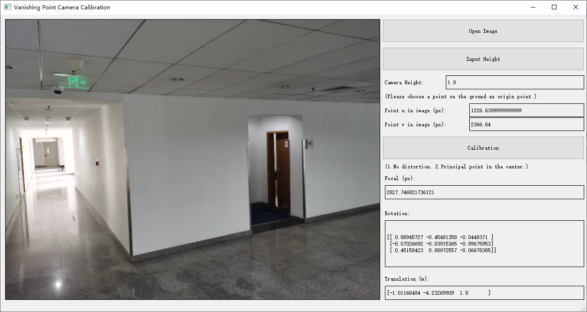

# Vanishing Point Camera Calibration

## 專案規格書 (Vanishing Point Calibration Tool)

本專案利用環境中的幾何線條（如牆角、地磚、建築邊緣）所產生的「消失點（Vanishing Point）」來推算相機的 3D 姿態與焦距標定。

---

### 1. 需求與驗證 (Requirements & Validation)

#### 核心需求
*   **功能**：針對室內走廊或建築場景的靜態影像或影片，計算相機的 3D 姿態：**Yaw（偏航）**、**Roll（滾轉）**、**Pitch（俯仰）** 以及 **Focal Length（焦距）**。
*   **效能**：支援嵌入式設備（如 **Raspberry Pi 4**）優化。單張影像處理時間約 **0.2-0.5 秒**（受解析度縮放與早停機制加速）。
*   **硬體適配**：針對 ARM 架構進行 OpenCV NEON 指令集優化適配。
*   **限制**：
    *   **環境**：Python 3.10+ 執行環境。
    *   **優點**：無需特定標定板，利用環境自然線條即可推算姿態與內參。
    *   **缺點**：在缺乏人工建築（如草地、野外）或線條混亂的環境下精度會下降。

*   **驗證計畫**：
*   **測試條件**：輸入包含明顯平行線（如牆角、地磚接縫）的影像。
*   **期待輸出**：UI 顯示旋轉矩陣與焦距，產出標定結果文字檔，並在影像上視覺化 X, Y, Z 軸。
*   **測試方法**：
    1.  **靜態測試**：讀取 `data/samples/` 資料夾下的樣本影像進行標定。
    2.  **結果比對**：檢查 `outputs/` 下的 `*CalibrationResult.txt` 是否包含合理的姿態角。

---

### 2. 系統分析 (Analysis)

#### 模組拆解 (Breakdown)

### 3. 系統設計

#### 資料流圖 (DFD)

```mermaid
graph LR
    Input[Image / Video Frame] -->|ndarray, Memory Pipe| LineExt[Line Extractor]
    LineExt -->|ndarray, N x 2 x 2| VPEngine[VP Engine: Fast Math Compare]
    VPEngine -->|list of ndarray 3, float32| PoseSolver1[Pose Solver: Extrinsic R & Focal f]
    PoseSolver1 -->|ndarray, float32, 3x3| PoseSolver2[Pose Solver: Euler Decomp]
    PoseSolver2 -->|video / image| Output[Output: OpenCV Rendered]
```

#### API Table
| 模組 | 函數名稱 | 輸入 (Type) | 輸出 (Type) | 核心依賴 |
| :--- | :--- | :--- | :--- | :--- |
| **I/O** | `read_image()` | path (str) | image (ndarray) | **OpenCV** |
| **Line** | `get_hough_lines_cv()` | edges (ndarray) | lines (ndarray) | **OpenCV** |
| **VP** | `run_line_ransac()` | lines (ndarray) | best_hypothesis | RANSAC / NumPy |
| **Pose** | `calculate_camera_attitude()` | R_w2c (ndarray) | attitude (Yaw,P,R) | `math.atan2` |
| **Draw** | `draw_axes_on_image()` | image, vps, origin | rendered_img | **OpenCV** |
| **UI** | `Ui_MainWindow` | QMainWindow | None | `PyQt5` |

---

### 4. 驗證

*圖 1: RANSAC 線段分群與消失點檢測（紅色：X 軸線段，綠色：Y 軸線段，藍色：Z 軸線段）*

*圖 2: 自動推算的 X, Y, Z 笛卡爾坐標軸（疊加於原圖）*

*圖 3: PyQt5 使用者介面與標定結果展示（顯示旋轉矩陣與焦距）*

#### 4.1 影片動態測試 (Dynamic Video Test)
針對動態場景，本工具支援逐幀標定並輸出視覺化坐標軸影片。

| 測試影片 (直接播放) | 說明 |
| :--- | :--- |
| <video src="results/result_v1.mp4" width="320" controls></video> | 成功追蹤辦公室走廊的 X, Y, Z 軸，焦距推算穩定。 |
| <video src="results/result_v2.mp4" width="320" controls></video> | 針對室內長廊環境，利用天花板與地面平行線條精準定位消失點。 |

*   **輸出路徑**：`outputs/` (本機產出), `results/` (展示文件)
