# 相機姿態估計：消失點與視覺里程計 (Camera Pose Estimation: Vanishing Point & Visual Odometry)

---

### 1. 需求
*   **功能**：偵測環境線段、計算 3D 姿態（Yaw, Pitch, Roll）、定位物理原點。
*   **效能**：運算支援 **8.5+ FPS** 處理，單圖運算 < 0.15s。
*   **限制**：需 Python 3.10+ 環境，依賴 OpenCV 與 NumPy。
*   **界面**：
    1. 輸入室內相片，輸出 Yaw, Pitch, Roll 數值並標示笛卡爾座標。
    2. 輸入雙鏡頭行車影像，輸出 3D 軌跡圖與 ATE (Absolute Trajectory Error) / RPE (Relative Pose Error) 誤差。
*   **驗收計畫 (Verification Plan)**：
    *   **測試資料**：`data/samples/rt0-7.jpg`（室內走廊）與 KITTI Odometry 序列。
    *   **預期輸出**：
        1.  **絕對準確度**：Pitch 角度在水平拍攝下趨近於 0°（誤差 < 3°）。
        2.  **相對追蹤 (Relative Tracking)**：在動態序列中，Yaw 與 Roll 的相對變化誤差 < 1.5°。
    *   **測試步驟 (DOE)**：
        *   **統一啟動介面**：直接執行 `python3 main.py`，系統將彈出輕量級 GUI 啟動選單 (支援 Raspi 等環境)。
        *   若選擇**單鏡頭**選項並開啟相片/影片，系統會自動載入單鏡頭消失點管線。
        *   若選擇**雙鏡頭**選項並開啟資料夾 (例如 KITTI Dataset)，系統會自動載入雙鏡頭視覺里程計管線。

---

### 2. 系統分析 (Analysis)

#### OpenCV 工具箱 (OpenCV Toolbox)
| 類別 | OpenCV 函式 (Function) | 本專案之用途 |
| :--- | :--- | :--- |
| **系統最佳化** | `cv2.setUseOptimized`, `cv2.ocl.setUseOpenCL` | 啟用底層硬體最佳化與 OpenCL 加速 |
| **影像與影片 I/O** | `cv2.imread`, `cv2.imwrite`, `cv2.VideoCapture`, `cv2.VideoWriter` | 讀寫單張相片、連續影格序列處理與成果影片編碼輸出 |
| **色彩與預處理** | `cv2.cvtColor`, `cv2.resize`, `cv2.convertScaleAbs` | 灰階與 RGB 空間轉換、影像縮小以提升運算速度、對比度線性強化 |
| **進階影像濾波** | `cv2.createCLAHE`, `cv2.GaussianBlur` | 解決逆光與陰影問題的自適應直方圖均衡化、高斯平滑降噪 |
| **邊緣與線段檢測** | `cv2.threshold` (Otsu), `cv2.Canny`, `cv2.HoughLinesP` | 最佳化二值化門檻、提取結構輪廓邊緣、利用機率霍夫變換找出建築與車道線段 |
| **特徵追蹤與匹配** | `cv2.ORB_create`, `cv2.BFMatcher` | ORB 特徵點萃取與二進制描述子計算、暴力特徵點追蹤與配對 |
| **立體視覺與姿態估計**| `cv2.StereoSGBM_create`, `cv2.solvePnPRansac`, `cv2.Rodrigues` | SGBM 雙目視差圖計算、利用 3D-2D 特徵對推算相機相對運動、旋轉矩陣與旋轉向量互相轉換 |
| **幾何繪圖與 GUI** | `cv2.line`, `cv2.arrowedLine`, `cv2.putText`, `cv2.addWeighted` | 標記消失點連線、繪製即時 3D 姿態軸 (XYZ)、渲染半透明文字 HUD 與動態資訊面板 |

#### RANSAC (隨機抽樣一致) 消失點檢測原理
RANSAC 的運作方式類似於「**隨機猜測 + 多數決**」。在真實影像中會有很多干擾線條（例如樹枝、陰影邊緣），我們透過不斷隨機測試，找出最多線條支持的「消失點」。

| 步驟 | 概念說明 | 程式實作技術 |
| :--- | :--- | :--- |
| **1. 採樣 (Sampling)** | **隨機挑選**：從畫面中隨機選出兩條線，假設它們是正確的邊緣。 | **Vectorized Batch Sampling** (批次生成 2000 組) |
| **2. 假設 (Hypothesis)** | **尋找交點**：將這兩條線延伸並算出交點，暫時將其當作「消失點」。 | **Homogeneous Cross Product** (齊次座標外積) |
| **3. 驗證 (Verification)** | **多數決投票**：檢查其他線條。指向交點的稱為 **Inliers (真正線索/支持者)**；干擾判斷的雜訊稱為 **Outliers (來亂的干擾者)**。找出擁有最多支持者的交點。 | **NumPy Matrix Multiply** (矩陣化運算) |
| **4. 精煉 (Refinement)** | **綜合重算**：重複數千次後找出最高票的交點。最後把所有 Inliers 集中起來，透過進階平均演算法求出一個滿足所有人的「最佳黃金交點」。 | **SVD (Singular Value Decomposition)** 奇異值分解 |

#### 演算法拆解 (Algorithm Breakdown)
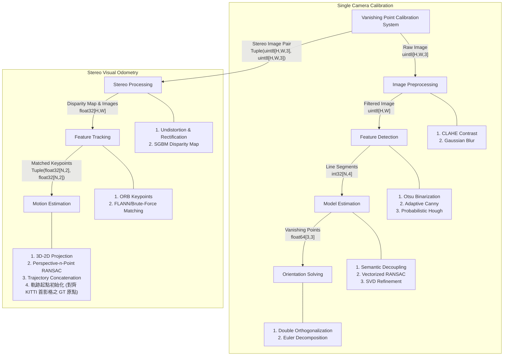

| 演算法 (Algorithm) | What (演算法內容) | Why (設計目的) | How (實作方式) |
| :--- | :--- | :--- | :--- |
| **CLAHE** | 限制對比度自適應直方圖均衡化 | 增強影像局部對比度，提取陰影或過曝區域的邊緣 | 將影像分割為 8x8 局部區塊進行直方圖均衡，並限制對比度增益 |
| **Gaussian Blur** | 高斯濾波 | 消除影像高頻噪點，防止邊緣檢測碎片化 | 利用 5x5 高斯核對影像執行卷積運算，在保留邊緣的同時平滑背景雜訊 |
| **Otsu's Binarization** | 大津演算法門檻控制  | 為邊緣檢測尋找二值化門檻 | 計算影像直方圖，最大化類間變異數以分離背景與前景結構 |
| **Adaptive Canny** | 邊緣檢測演算法 | 提取結構化輪廓 | 結合 Otsu 門檻動態調整 Canny 的遲滯門檻 (Hysteresis Thresholding) |
| **Probabilistic Hough** | 霍夫變換線段偵測 | 將邊緣點群聚合為幾何線段 | 透過 `minLineLength` 過濾短線段，保留建築與車道線結構 |
| **Vectorized RANSAC** | 隨機抽樣一致演算法 | 從線段池中篩選出有效線段 | 利用 NumPy 廣播機制一次生成多組假設，提升運算效能 |
| **Singular Value SVD** | 奇異值分解矩陣運算  [參考文章](https://levelup.gitconnected.com/unlocking-insights-exploring-singular-value-decomposition-svd-and-its-dynamic-applications-238377ccbd51) | 從投票後的 Inlier 線段集中算出小數點精確度的交點座標 | 建立超定齊次方程組 $A\mathbf{v} = \mathbf{0}$，透過 $A = U \Sigma V^T$ 提取最小奇異值對應之特徵向量 $\mathbf{v} = V_{[:, -1]}$ 作為消失點座標 |
| **Manhattan World Ortho** | 曼哈頓世界正交化約束 | 確保三軸消失點在物理空間中互相垂直 | 透過 Cross Product 執行二次正交校準，確保旋轉矩陣之正規性 |
| **Euler Decomposition** | 歐拉角分解演算法  | 從旋轉矩陣中提取 Yaw, Pitch, Roll 指標 | 基於相機座標系 (Z-Forward)，利用 atan2 函數處理矩陣項之比例關係 |
| **SGBM** | 立體匹配與視差計算 [原理說明連結](https://jiweibo.github.io/StereoBM/) | 從雙鏡頭影像獲取 3D 深度資訊 | 使用 Semi-Global Block Matching 建立視差圖 |
| **SIFT / ORB** | 特徵點檢測與描述  | 建立連續影像間的特徵對應基準 | 在尺度空間中尋找極值點並計算局部特徵描述子 |
| **PnP RANSAC** | 相機姿態估計  | 因為在追蹤 3D 點的時候，常常會不小心追蹤錯（例如把左邊的樹葉誤認成右邊的樹葉，這就是 Outlier）。所以我們把 PnP 塞進 RANSAC 裡面，讓電腦每次隨機挑幾個 3D 點來猜測相機位置，然後大家投票，藉此剔除那些「追蹤錯誤的雜訊」 | 利用 2D-3D 特徵點對應，以 RANSAC 篩選 Inliers 並求解旋轉與平移矩陣 |

---

### 3. 系統設計 (System Design)

#### 資料流圖 (DFD) 與效能甘特圖
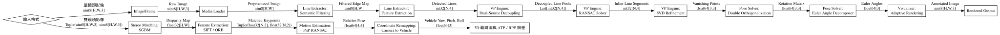
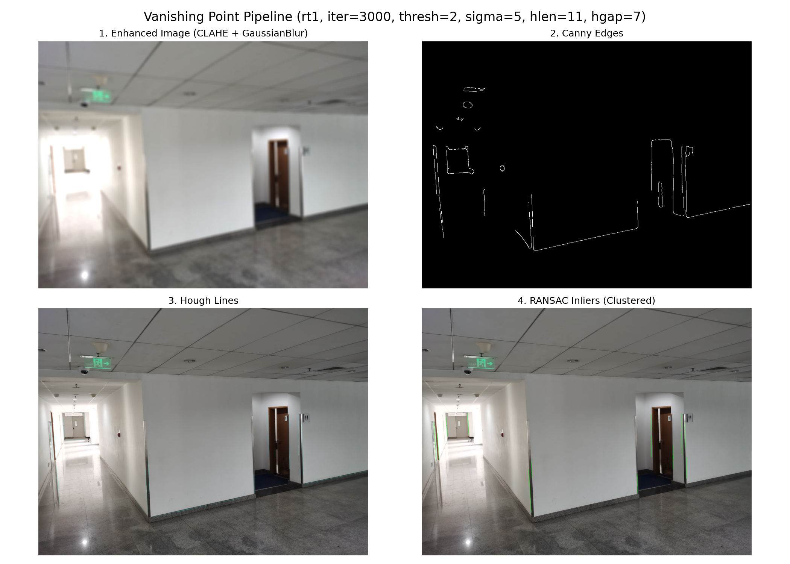
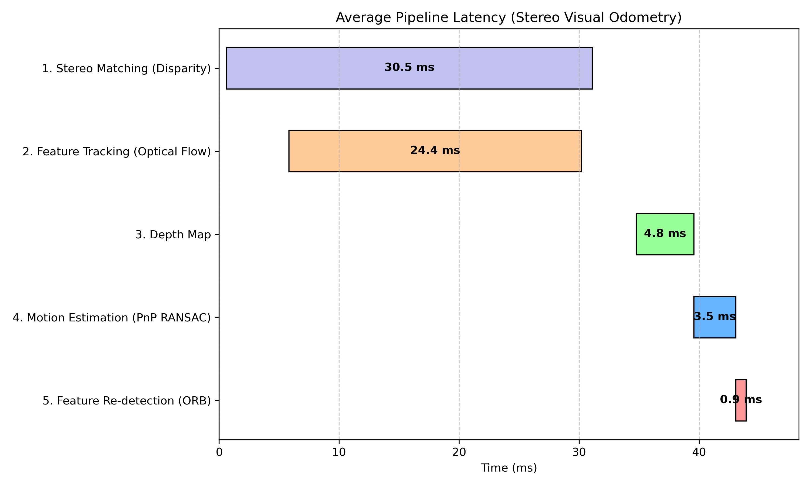

#### API Table
| 模組 | 函數名稱 | 參數與資料型態 (Datatypes) | 描述 |
| :--- | :--- | :--- | :--- |
| **Line Extractor** | `get_hough_lines_cv()` | `img: np.ndarray[uint8, 2D]` `-> lines: np.ndarray[int32, (N,4)]` | 提高邊緣閾值，過濾樹木紋理，找出結構線段 |
| **VP Engine** | `get_vp_inliers()` | `lines: np.ndarray[int32, (N,4)]` `-> vps: np.ndarray[float64, (3,3)]` | 分離地平面與垂直結構特徵，利用 RANSAC 尋找消失點 |
| **Pose Solver** | `calculate_rotation_matrix()`| `vps: np.ndarray[float64, (3,3)]` `-> rot_matrix: np.ndarray[float64, (3,3)]` | 基於 Z-Forward 標準實作二次正交校準以計算旋轉矩陣 |
| **Visualizer** | `draw_axes_on_image()` | `img: np.ndarray[uint8, 3D], rot_matrix: np.ndarray` `-> out_img: np.ndarray[uint8, 3D]` | 支援無窮遠消失點渲染，自動投影並繪製 3D 姿態軸 |
| **Visual Odometry**| `VisualOdometryEstimator.run()`| `left_img: np.ndarray[uint8, 3D], right_img: np.ndarray[uint8, 3D]` `-> pose: np.ndarray[float64, (4,4)]` | 結合立體視差與特徵追蹤，透過 PnP RANSAC 求解相機姿態 |

---

### 4. 驗證與結果

#### 4.1 GUI 交互界面
 

### 室內圖像 (單鏡頭)
| 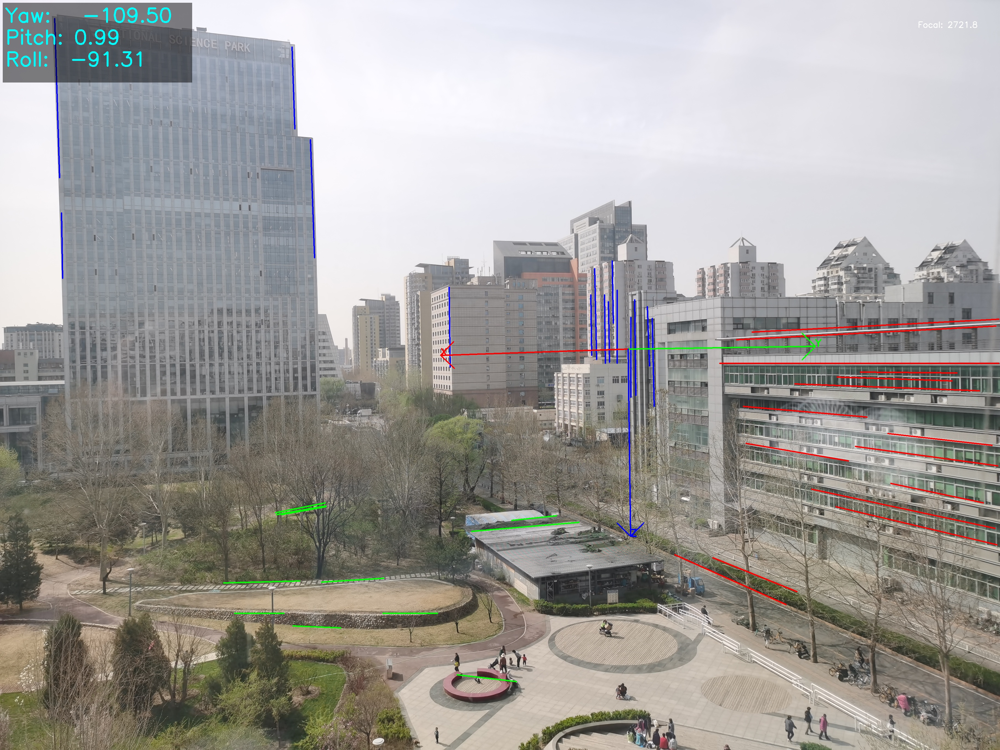 | 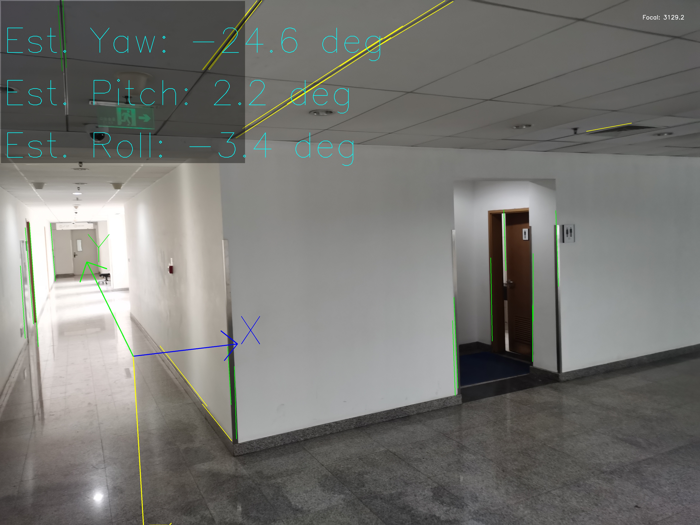 | 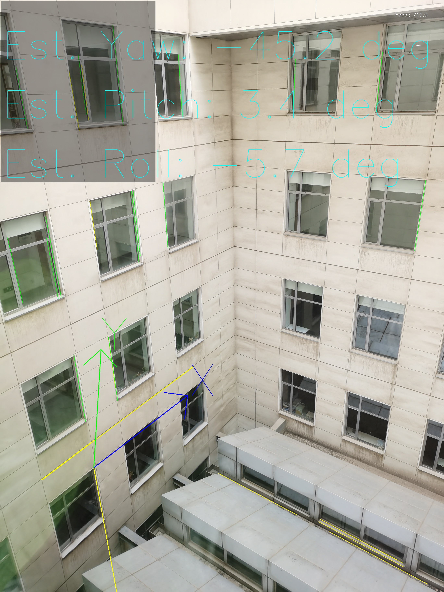 | 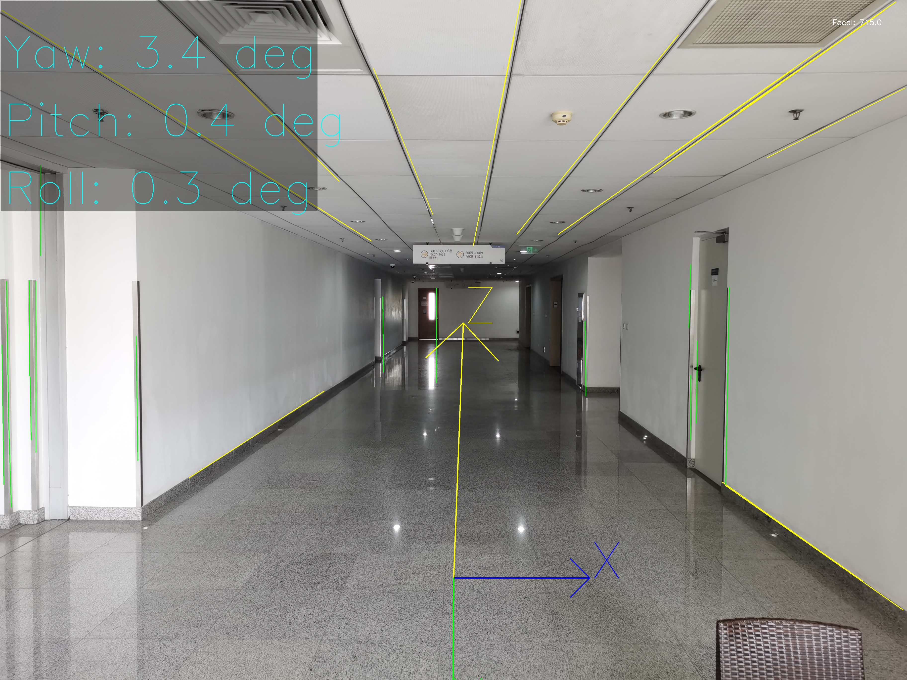 |
| :---: | :---: | :---: | :---: |
| **Indoor: rt0** | **Indoor: rt1** | **Indoor: rt2** | **Indoor: rt3** |
| 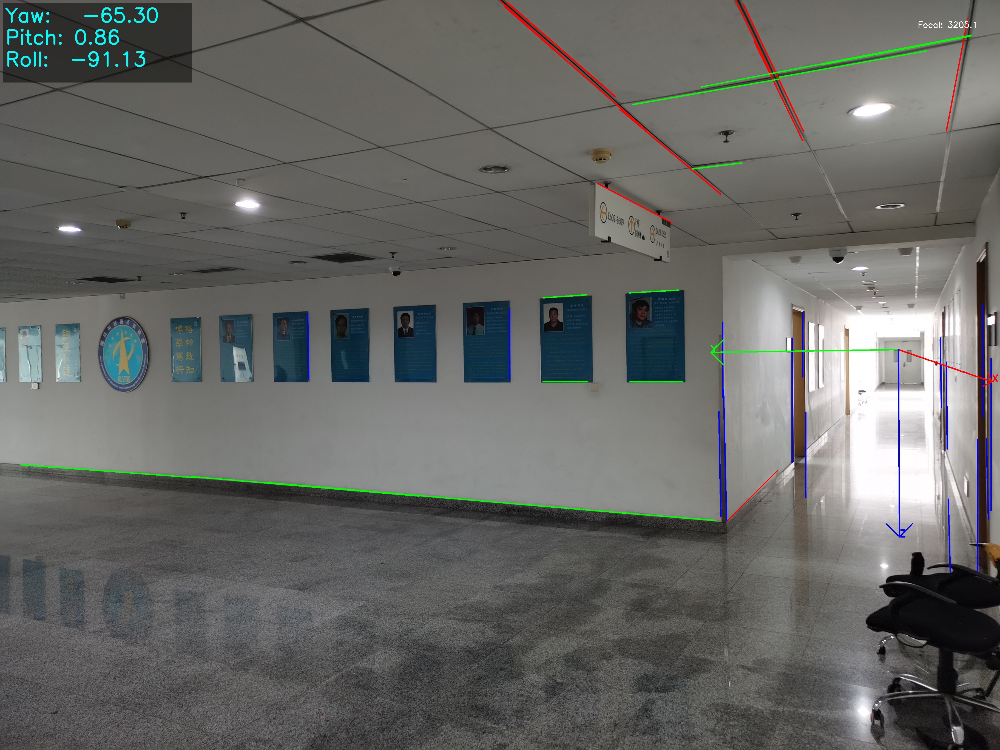 | 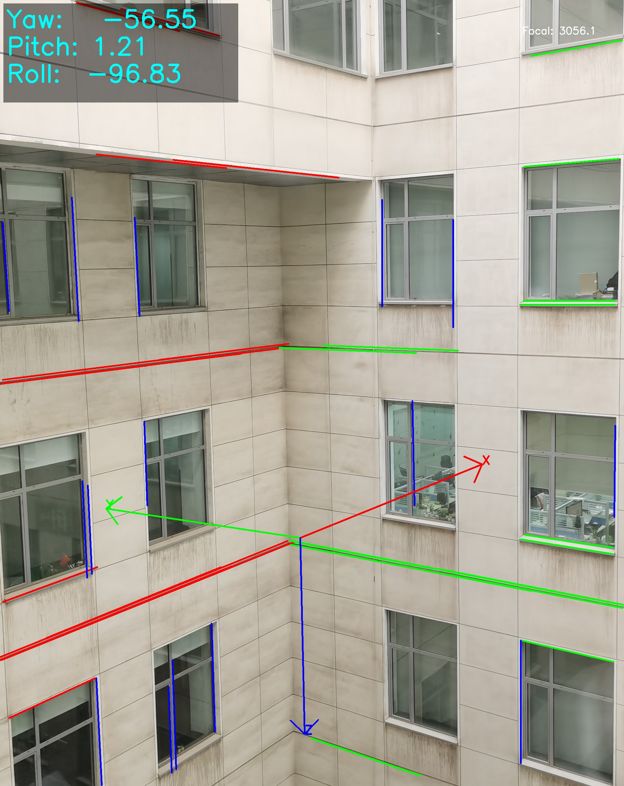 | 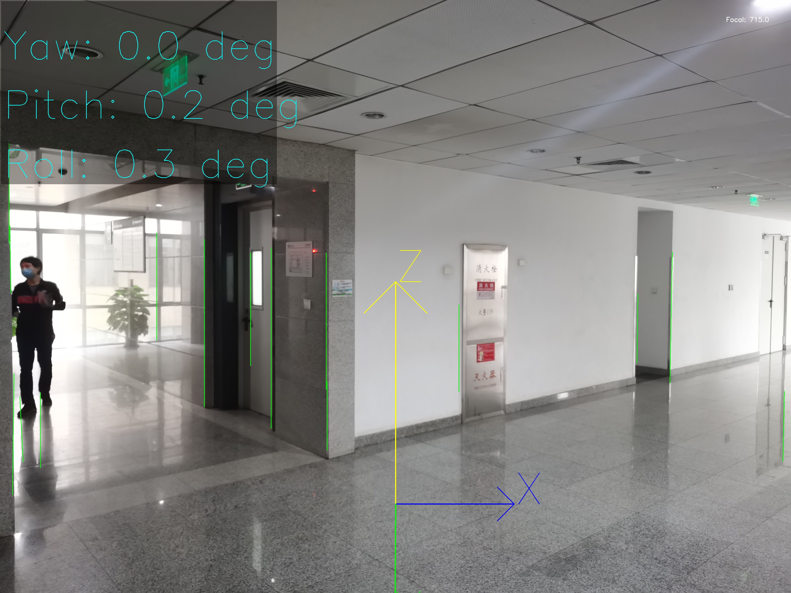 | 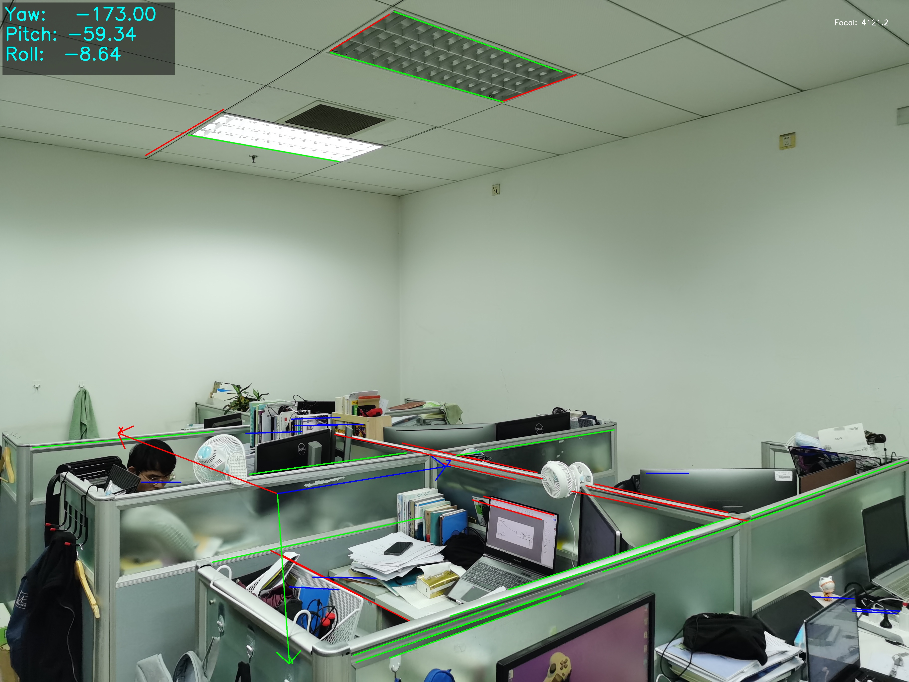 |
| **Indoor: rt4** | **Indoor: rt5** | **Indoor: rt6** | **Indoor: rt7** |

#### 4.2 KITTI 道路實測成果 (Dynamic Sequences)

**單鏡頭 單frame 輸入 (Vanishing Point 標定)**：
| 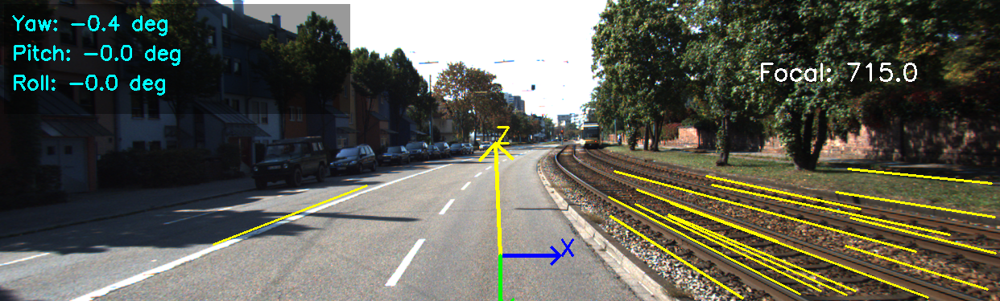 | 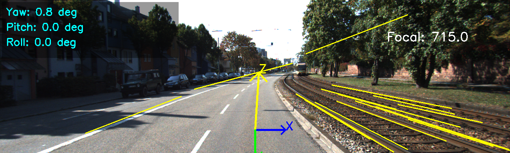 | 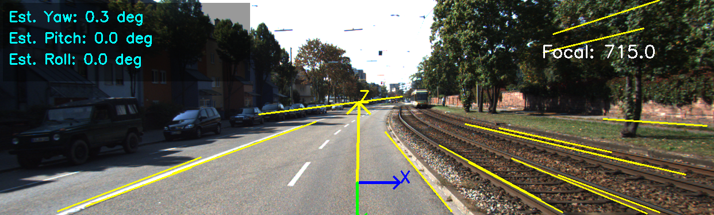 |
| :---: | :---: | :---: |
| **00: 初始偏差校正** | **01: 結構轉角定位** | **08: 長直線深度追蹤** |

**雙鏡頭輸入 (Stereo Visual Odometry 軌跡與誤差驗證)**：
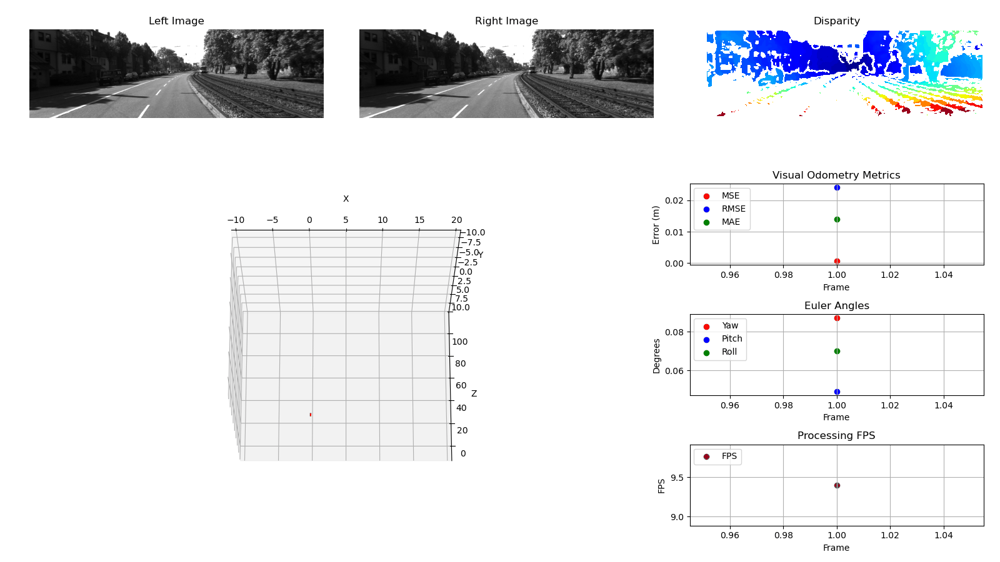
**註**：`Prediction` (紅線) 為推估軌跡，`Ground Truth` (藍線) 為真實軌跡；右方圖表同步顯示 Yaw、Pitch、Roll 變化以利 ATE (Absolute Trajectory Error) / RPE (Relative Pose Error) 誤差對比。

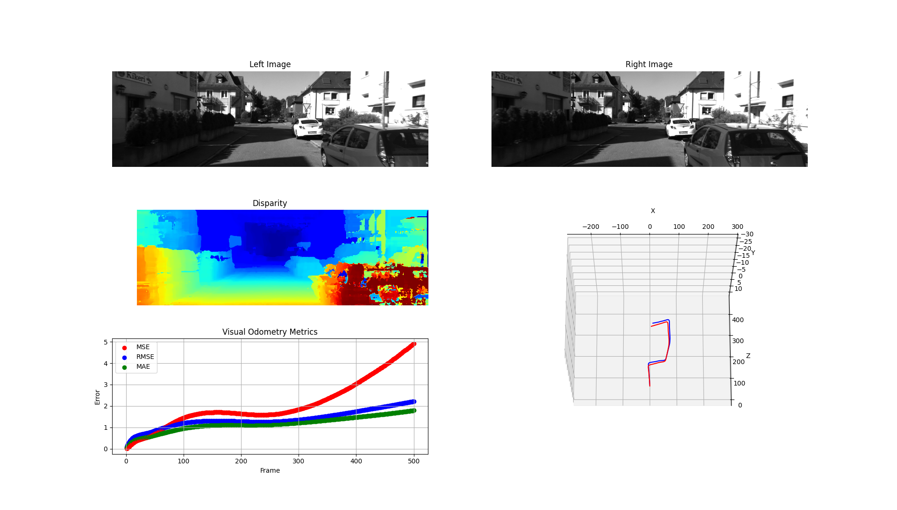

**效能優化歷程**：

| 優化項目 | 演算法變更 | FPS | 絕對軌跡誤差 (ATE) | 影響機制 |
| :--- | :--- | :--- | :--- | :--- |
| **特徵擷取** | SIFT -> ORB | ~3.1 -> ~13.0 | - | - |
| **立體匹配** | SGBM -> Block Matching | ~13.0 -> 16.16 | 0.3133 m -> 0.1266 m | Block Matching 雜訊容忍度搭配特徵點追蹤，過濾 SGBM 產生之邊緣離群值 |
| **追蹤與數學運算** | 光流追蹤 + Numba JIT + 平行運算 | 16.16 -> ~22.17 | 0.1266 m -> 0.1114 m | 採用 KLT 光流取代逐幀匹配，以 ThreadPool 平行處理視差，並利用 JIT 加速矩陣運算 |
