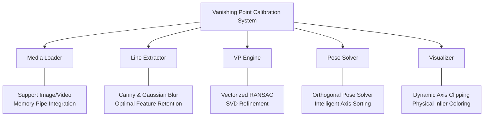
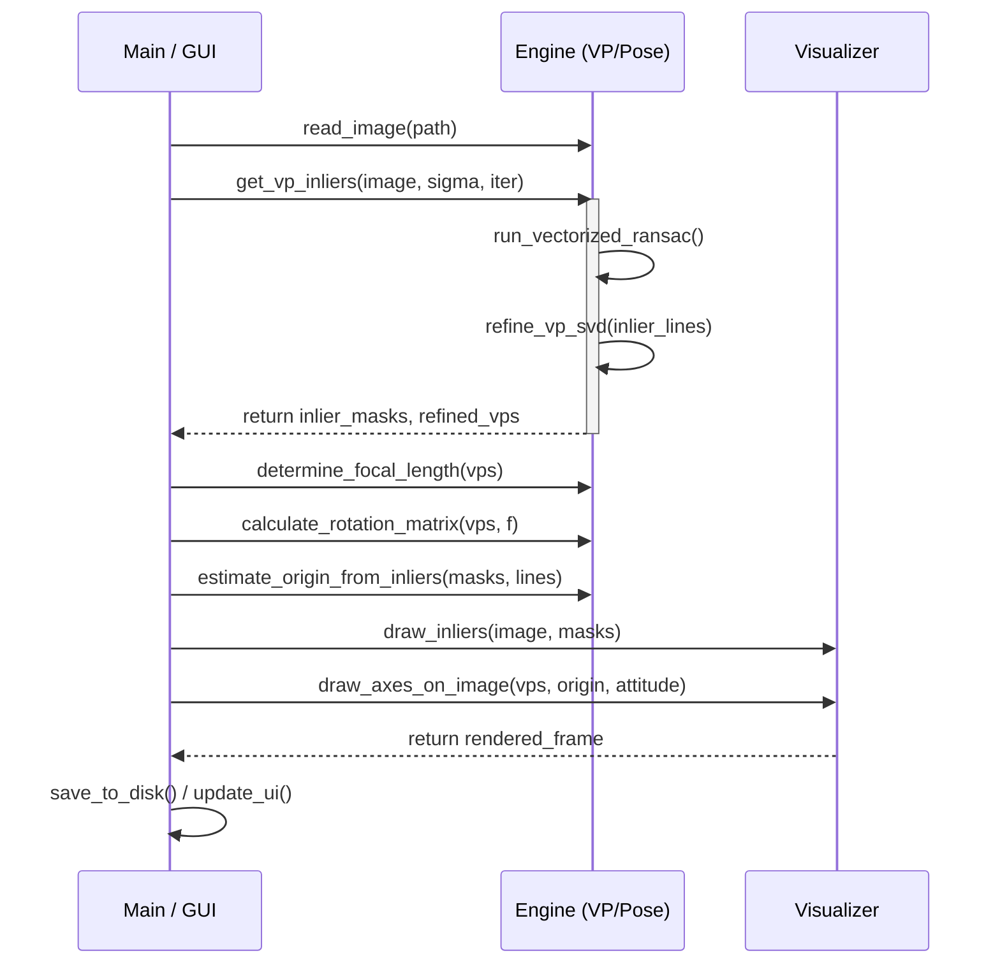
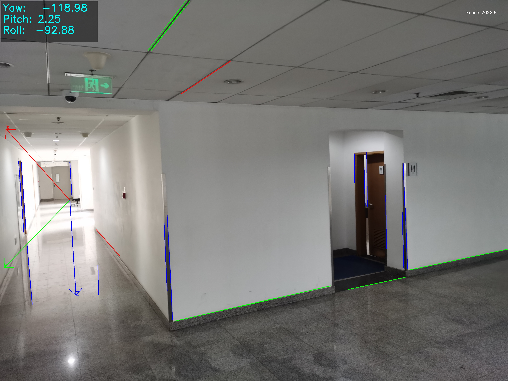
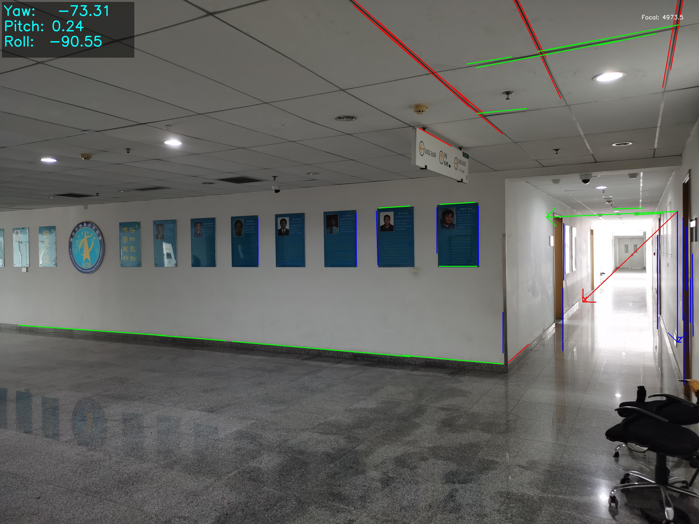
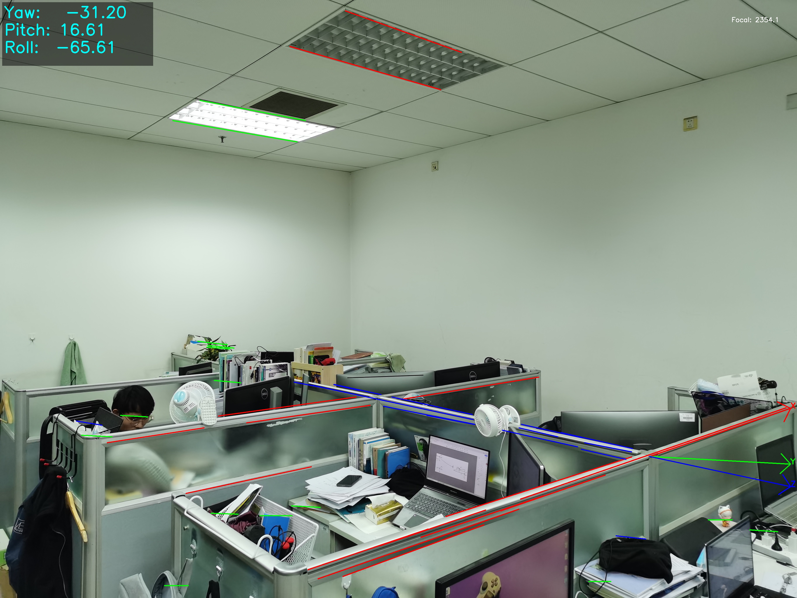

# Vanishing Point Camera Calibration
本專案利用環境中的幾何線條（如牆角、地磚、建築邊緣）所產生的「消失點（Vanishing Point）」來推算相機的 3D 姿態與焦距標定。

---

### 1. 需求與驗收計畫
*   **功能**：自動偵測環境線段、計算 3D 姿態（Yaw, Pitch, Roll）、估算焦距（Focal）、自動定位物理原點。
*   **效能**：支援 **8.5+ FPS** 即時處理（較初始版本提升 5 倍），單圖運算 < 0.15s。
*   **限制**：需 Python 3.10+ 環境，依賴 OpenCV 與 NumPy。
*   **界面**：
    *   **檔案輸入**：支援 `.jpg`, `.png` 靜態影像與 `.mp4`, `.avi` 影片路徑。
    *   **Stream**：底層支援 Memory Pipe 整合，可擴展至即時串流。
*   **驗收計畫 (Verification Plan)**：
    *   **測試資料**：`data/samples/rt0-7.jpg`（室內走廊場景）。
    *   **測試條件**：影像需包含至少兩組明顯的平行線（如牆腳與天花板邊緣）。
    *   **期待輸出**：
        1.  **視覺化**：X 軸精確對齊走廊長線，Z 軸垂直向上，原點位於牆角。
        2.  **數值**：Pitch 角度在水平拍攝下應趨近於 0°（誤差 < 3°）。
    *   **測試步驟 (DOE)**：
        1.  執行批量處理腳本：`for i in {0..7}; do python3 main.py data/samples/rt$i.jpg; done`
        2.  對比不同 `sigma` 與 `iterations` 對 `rt0`（暗處）與 `rt7`（高噪點）的穩定度影響。

---

### 2. 系統分析 (Analysis)

#### RANSAC 消失點檢測原理
| 步驟 | 動作 | 當前實作技術 |
| :--- | :--- | :--- |
| **1. 採樣 (Sampling)** | 隨機選取兩條線段作為一組模型假設 | **Vectorized Batch Sampling** (一次生成 3000 組) |
| **2. 假設 (Hypothesis)** | 計算兩條線的交點作為潛在消失點 | **Homogeneous Cross Product** (齊次座標外積) |
| **3. 驗證 (Verification)** | 計算所有線段到該點的角度殘差，統計 Inliers | **NumPy Matrix Multiply** (矩陣化殘差計算) |
| **4. 精煉 (Refinement)** | 使用所有投票線段重新求解最優交點 | **SVD (Singular Value Decomposition)** 奇異值分解 |

#### 模組拆解 (Breakdown)

---

### 3. 系統設計 (System Design)

#### 資料流圖 (DFD)

```mermaid
graph LR
    Img[Image/Frame] --> Pre[Preprocessing: Sigma Blur]
    Pre --> Line[Hough Line Extractor]
    Line --> RANSAC[Vectorized RANSAC Solver]
    RANSAC --> SVD[SVD VP Refinement]
    SVD --> Origin[Origin Estimator: Lower Intersections]
    Origin --> Ortho[Manhattan Orthogonalization]
    Ortho --> Pose[Euler Angle Decomposer]
    Pose --> Render[Visualizer: Axis Clipping]
    Render --> Out[Rendered Output]
```

#### 循序圖 (MSC Diagram)

#### API Table
| 模組 | 函數名稱 | 輸入 | 輸出 | 核心描述 |
| :--- | :--- | :--- | :--- | :--- |
| **Engine** | `get_vp_inliers()` | `ndarray, sigma, iter` | `masks, vps` | 整合 RANSAC 與 SVD 的核心偵測入口 |
| **Engine** | `refine_vp_svd()` | `ndarray (lines)` | `ndarray (vp)` | 使用奇異值分解從線段集中提取精確消失點 |
| **Engine** | `estimate_origin_from_inliers()` | `shape, masks, lines` | `list [x, y]` | 尋找下半部 X/Z 線段交點作為地平線原點 |
| **Solver** | `calculate_rotation_matrix()` | `vps, focal, pp` | `ndarray (3x3)` | Manhattan World 強制正交旋轉矩陣建構 |
| **Visual** | `draw_axes_on_image()` | `vps, origin, attitude` | `ndarray` | 支援 Axis Clipping 與 Euler 角顯示的渲染器 |

---

### 4. 驗證與結果

#### 4.1 典型輸出展示 (Sample Outputs)

|  |  |  |
| :---: | :---: | :---: |
| **rt1: 牆角精確對齊** | **rt4: 自動原點估計** | **rt7: 高噪點穩定檢測** |

