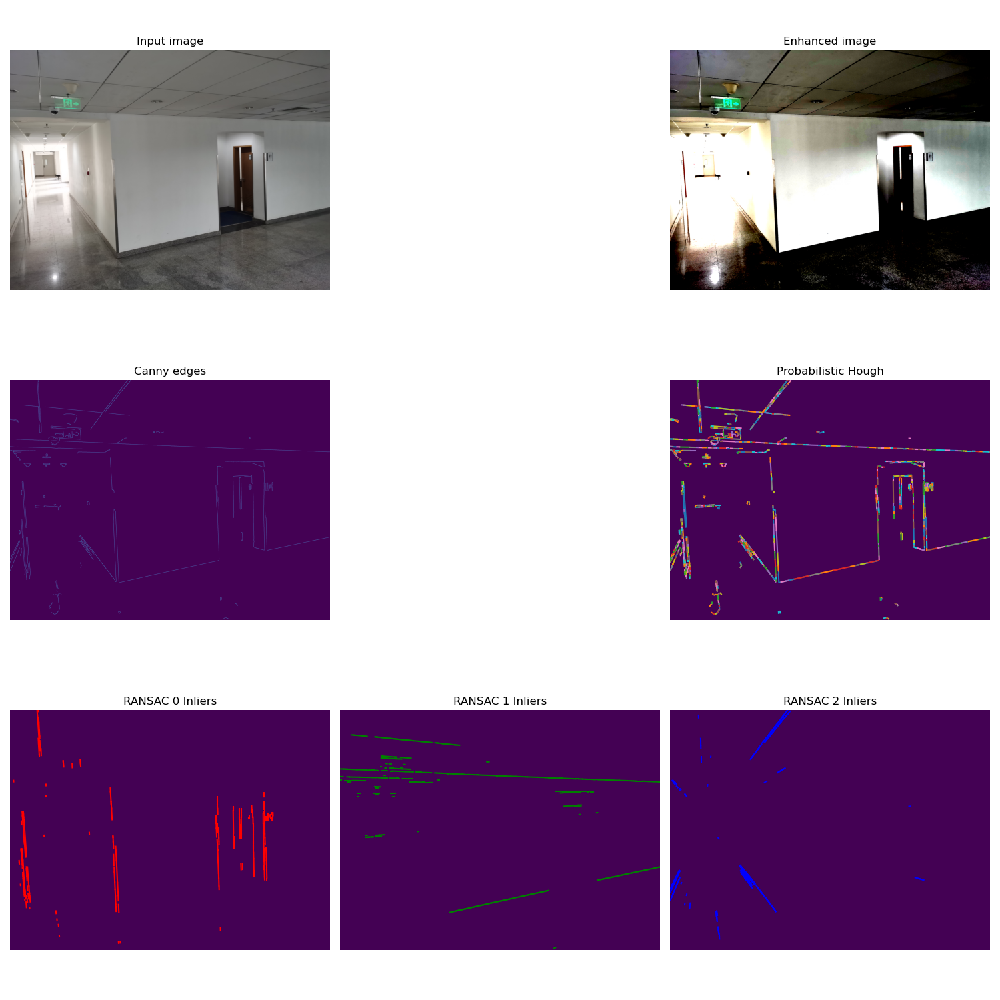

# Vanishing Point Camera Calibration

## 專案規格書 (Vanishing Point Calibration Tool)

本專案利用環境中的幾何線條（如牆角、地磚、建築邊緣）所產生的「消失點（Vanishing Point）」來推算相機的 3D 姿態與焦距標定。

---

### 1. 需求與驗證 (Requirements & Validation)

#### 核心需求
*   **功能**：針對室內走廊或建築場景的靜態影像，計算相機的 3D 姿態：**Yaw（偏航）**、**Roll（滾轉）**、**Pitch（俯仰）** 以及 **Focal Length（焦距）**。
*   **效能**：離線標定工具，單張影像處理時間約 1-3 秒（受 RANSAC 迭代次數影響）。
*   **限制**：
    *   **環境**：Python 3.10+ 執行環境。
    *   **演算法**：基於 Scikit-Image 與 NumPy 的傳統視覺演算法。
    *   **假設**：依賴場景中存在 3 組正交消隱點（曼哈頓世界假設），且輸入影像已預先去畸變或畸變極小。
    *   **優點**：無需特定標定板，利用環境自然線條即可推算姿態與內參。
    *   **缺點**：在缺乏人工建築（如草地、野外）或線條混亂的環境下精度會大幅下降。

*   **驗證計畫**：
*   **測試條件**：輸入包含明顯平行線（如牆角、地磚接縫）的影像。
*   **期待輸出**：UI 顯示旋轉矩陣與焦距，產出標定結果文字檔，並在影像上視覺化 X, Y, Z 軸。
*   **測試方法**：
    1.  **靜態測試**：讀取 `RealTest/` 資料夾下的樣本影像進行標定。
    2.  **結果比對**：檢查 `RunResult/` 下的 `CalibrationResult.txt` 是否包含合理的姿態角。

---

### 2. 系統分析 (Analysis)

#### 模組拆解
| 模組名稱 | 功能描述 |
| :--- | :--- |
| **Image Loader** | 透過 PyQt5 介面讀取 .jpg 或 .png 靜態影像。 |
| **Line Extractor** | 使用 Canny 邊緣檢測與 **Probabilistic Hough Transform** 進行線段提取。 |
| **VP Engine** | 利用 RANSAC 演算法在曼哈頓世界假設下從線段中分群出三組正交消失點。 |
| **Pose Solver** | 根據消失點構造旋轉矩陣 $R$、推算焦距 $f$，並解析為 Y, R, P 姿態角。 |

#### 資料流圖 (DFD)
```plaintext
[Static Image] 
  -- (ndarray, uint8, HxWx3) -------> [Line Extractor] 
  -- (ndarray, (N, 2, 2)) ----------> [VP Engine] 
  -- (list[ndarray(3,)], float32) --> [Pose Solver: Extrinsic R & Focal f] 
  -- (ndarray, float32, 3x3) -------> [Pose Solver: Euler Decomp]
  -- (text/image) ------------------> [Output & Visualization]
```

#### API Table
| 模組 | 函數名稱 | 輸入 (Type) | 輸出 (Type) | 核心依賴 |
| :--- | :--- | :--- | :--- | :--- |
| **I/O** | `read_image()` | path (str) | image (ndarray) | `skimage.io` |
| **Line** | `get_hough_lines()` | edges (ndarray) | lines (ndarray) | `skimage.transform` |
| **VP** | `run_line_ransac()` | lines (ndarray) | best_hypothesis | RANSAC / NumPy |
| **Pose** | `calculate_camera_attitude()` | R_w2c (ndarray) | attitude (Yaw,P,R) | `math.atan2` |
| **UI** | `setup_ui()` | MainWindow | None | `PyQt5` |

---

### 3. 關鍵代碼實現參考

```python
# 旋轉矩陣轉相機絕對姿態 (Yaw-Pitch-Roll)
def calculate_camera_attitude(R_w2c):
    R_c2w = np.transpose(R_w2c)
    sy = math.sqrt(R_c2w[0, 0] * R_c2w[0, 0] + R_c2w[1, 0] * R_c2w[1, 0])
    singular = sy < 1e-6
    if not singular:
        pitch = math.atan2(-R_c2w[2, 0], sy)
        yaw = math.atan2(R_c2w[1, 0], R_c2w[0, 0])
        roll = math.atan2(R_c2w[2, 1], R_c2w[2, 2])
    else:
        pitch = math.atan2(-R_c2w[2, 0], sy)
        yaw = math.atan2(-R_c2w[0, 1], R_c2w[1, 1])
        roll = 0
    return np.degrees([yaw, pitch, roll])
```

---

### 4. 專案視覺效果


*圖 1: RANSAC 線段分群與消失點檢測（紅色：X 軸線段，綠色：Y 軸線段，藍色：Z 軸線段）*


*圖 2: 自動推算的 X, Y, Z 笛卡爾坐標軸（疊加於原圖）*


*圖 3: PyQt5 使用者介面與標定結果展示（顯示旋轉矩陣與焦距）*
